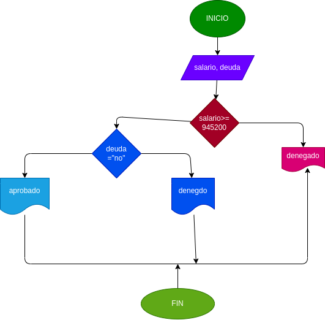

## prestamo bancario
programa para si usted puede requerir un prestamo en el banco segun su salario y si tiene de deuds anteriores 

# ANALISIS
Variable de entrada

salario = el dinero necesario para adquirir el pretamo
deuda = saber si tiene deudas anteriores

Variable de proceso 
salirio >= numero ingresado
deuda = sio no tienes deudas 

variable de salida

aceptado = su prestamo fue aceptado 
denegado = su prestamo fue denegado

nos indicara si se acepto o se denego su prestamo 

# DISEÑO

# construccion 