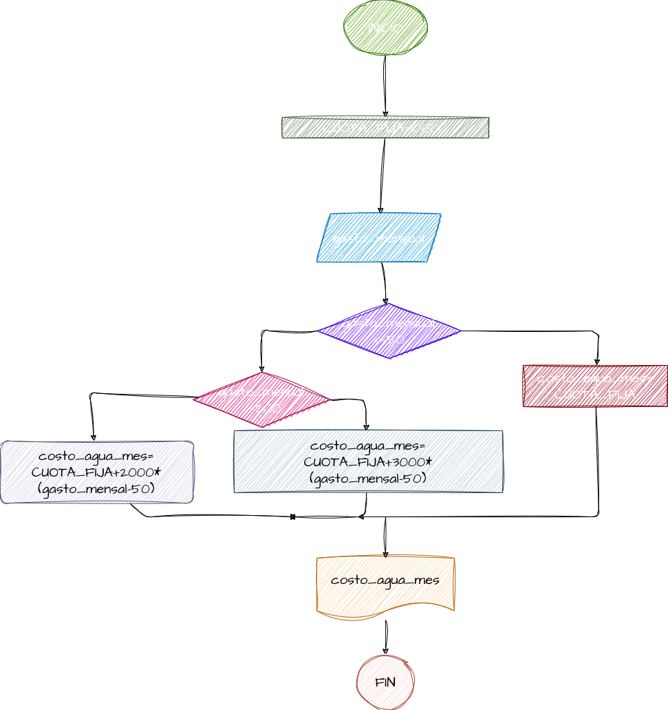

## GASTO DE AGUA
programa para saber cuanto hay que pagar deacuerdo a su gasto de agua en m3

# ANALISIS

--Varablesde entrada

M3 = cuantos m3 gato de agua
PRECIO_NORMAL = 10000

--Varibles de proceso

PAGO = se calcula lo que hay que pagar y se almacenan en esta variable 

--Variables de salida 

PAGO =  se muestra cuanto debe ser el pago por el agua

# DISEÑO

 

# CONSTRUCCION
